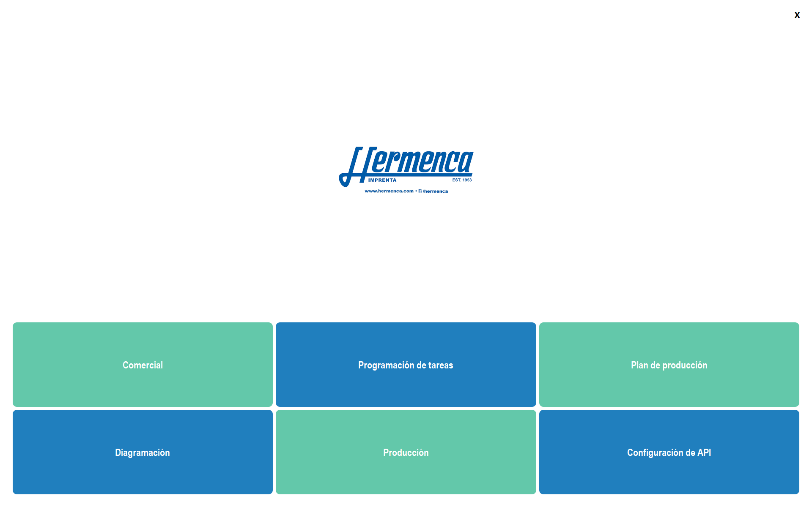
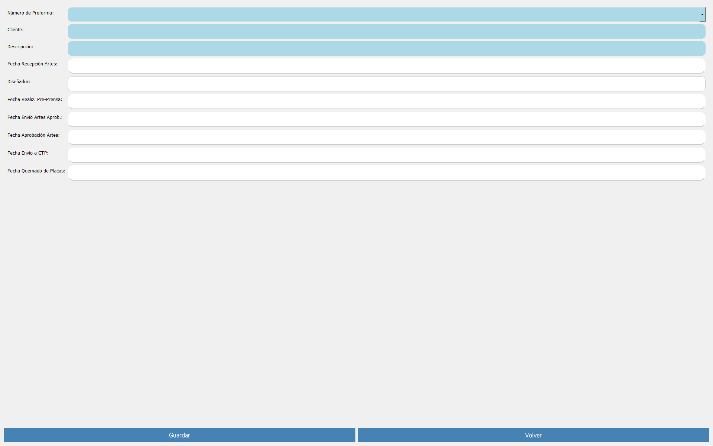
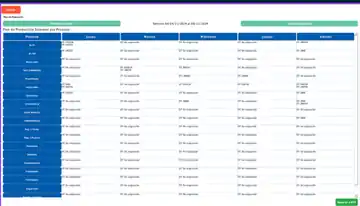

# ERP for the Graphic Industry

<p align="center">
  <strong>Integrated Desktop Workflow for Commercial Orders, Prepress, Production Scheduling, and Graphic-Process Coordination</strong>
</p>

<p align="center">
  A Python and PyQt5 operational platform connecting proformas, work orders, production processes, weekly planning, Google Apps Script services, and industrial communication.
</p>

---

## Visual Overview

<p align="center">
  
</p>

<p align="center">
  <strong>Central operational dashboard</strong><br>
  <sub>Direct access to Commercial, Task Scheduling, Production Planning, Diagramming, Production, and API Configuration.</sub>
</p>

| Diagramming and Prepress | Weekly Production Plan |
|:---:|:---:|
| <a href="assets/figures/erp_diagramming_module.webp"></a> | <a href="assets/figures/erp_weekly_production_plan.webp"></a> |
| Approved-proforma selection, customer information, artwork reception, designer assignment, prepress milestones, CTP delivery, and plate preparation. | Monday-to-Friday production matrix organized by graphic process, with week navigation and PDF export. |

<p align="center"><sub>Click either screenshot to open the complete image.</sub></p>

---

## Executive Overview

**ERP for the Graphic Industry** is a specialized desktop application developed to coordinate the operational workflow of a printing and graphic-production company. The system connects the commercial, prepress, and production stages through a shared information flow, reducing fragmented records and improving the traceability of each approved quotation and production order.

The application is implemented in **Python with PyQt5** and communicates through HTTP with a **Google Apps Script** service backed by Google Sheets. This architecture allows commercial data, design milestones, production requirements, process assignments, and scheduled delivery activities to be maintained in a common operational dataset.

In addition to the business workflow, the system includes a background **Modbus TCP server**, providing a foundation for future integration with industrial equipment, supervisory interfaces, production indicators, or shop-floor automation.

---

## Operational Scope

The platform organizes the lifecycle of a graphic-production request across five principal areas:

| Area | Operational Responsibility |
| --- | --- |
| **Commercial** | Creation and editing of approved proformas, customer information, order quantities, descriptions, and delivery commitments. |
| **Diagramming / Prepress** | Registration of artwork reception, designer assignment, prepress progress, customer approval, CTP delivery, and plate preparation. |
| **Production** | Conversion of approved work into production orders, materials, print runs, machines, finishing operations, and process requirements. |
| **Task Scheduling** | Assignment of work orders to dates and specific production processes through an interactive scheduling interface. |
| **Production Planning** | Weekly visualization of scheduled work by process, with navigation between weeks and exportable PDF reports. |

---

## Process Flow

```text
Approved Proforma
       │
       ▼
Commercial Registration
       │
       ▼
Diagramming and Prepress
       │
       ▼
Production Order Definition
       │
       ├── Printing processes
       ├── Finishing processes
       ├── Materials and quantities
       └── Required production resources
       │
       ▼
Task Scheduling by Process and Date
       │
       ▼
Weekly Production Plan and PDF Reporting
```

Each department contributes information to the same operational record, allowing the organization to follow a job from customer approval to production scheduling.

---

## System Architecture

```text
┌──────────────────────────────────────────────┐
│        Python / PyQt5 Desktop Client         │
│                                              │
│  Commercial · Diagramming · Production      │
│  Task Scheduling · Weekly Planning · PDF    │
└──────────────────────┬───────────────────────┘
                       │ HTTP GET / POST
                       ▼
┌──────────────────────────────────────────────┐
│             Google Apps Script API           │
│                                              │
│  Validation · Record management · Routing   │
│  Proforma numbering · OT assignment         │
└──────────────────────┬───────────────────────┘
                       │
                       ▼
┌──────────────────────────────────────────────┐
│               Google Sheets                  │
│                                              │
│  Shared operational records and process     │
│  sheets for production coordination         │
└──────────────────────────────────────────────┘

┌──────────────────────────────────────────────┐
│       Background Modbus TCP Interface        │
│                                              │
│  Foundation for industrial-system and       │
│  equipment-level integration                │
└──────────────────────────────────────────────┘
```

---

## Main Application Modules

### Commercial Management

The commercial interface supports the creation and editing of approved proformas. Multiple orders can be entered in one session, and proforma numbering is generated from the shared operational dataset.

Principal data includes the commercial executive, customer, customer classification, product description, requested quantity, delivery date, and approved-proforma number.

### Diagramming and Prepress

The diagramming module documents the transition from the commercial request to production-ready artwork. It tracks:

- Artwork reception date.
- Assigned designer.
- Prepress completion.
- Artwork submission for approval.
- Customer approval date.
- CTP submission.
- Plate-burning completion.

The screenshot in the visual overview shows a real operational record inside this module.

### Production Management

The production module records the technical definition of the work order, including materials, sheet quantities, print run, printing-machine requirements, ink, plates, printing type, number of passes, and post-print processes.

When a process is selected, the corresponding OT is also registered in its process-specific worksheet, creating a structured production queue.

### Task Scheduling

The scheduling interface loads available OTs by production process and allows them to be assigned to calendar dates. It includes process selection, available and assigned OT lists, drag-and-drop assignment, calendar scheduling, reassignment, and background data loading.

### Weekly Production Plan

The production-planning module consolidates assigned work into a weekly matrix organized by process and working day. It provides:

- Previous- and next-week navigation.
- Monday-to-Friday production overview.
- Process-oriented workload visualization.
- Automatic organization of scheduled OTs.
- Export of the weekly plan to an A4 PDF document.

### API Configuration

The desktop client includes a configurable Apps Script endpoint. The selected URL is persisted through `QSettings`, allowing deployments to update the service address without changing the source code.

### Modbus TCP Service

A Modbus TCP server is launched in a background thread when the application starts. The current implementation exposes discrete inputs, coils, holding registers, and input registers as a foundation for future machine, PLC, dashboard, or shop-floor integration.

---

## Graphic-Production Processes

| Category | Supported Processes |
| --- | --- |
| Printing | XL75, XL-UV, typographic, and cylindrical operations. |
| Surface finishing | Varnishing, plastic lamination, localized finishing, and dry embossing. |
| Decorative finishing | Hot stamping. |
| Cutting and forming | Easy Matrix, perforation, and folding. |
| Assembly | Collating, stapling, padding, spiral binding, one-point gluing, three-point gluing, and Tesa-tape bonding. |

Each selected process receives the relevant OT while remaining linked to the primary production record.

---

## Technical Profile

| Category | Implementation |
| --- | --- |
| Application type | Desktop ERP / production-coordination system |
| Primary language | Python |
| User interface | PyQt5 |
| Service communication | HTTP GET and POST through `requests` |
| Backend service | Google Apps Script |
| Operational data layer | Google Sheets |
| Industrial protocol | Modbus TCP through `pymodbus` |
| Document generation | PDF reports through ReportLab |
| Local configuration | `QSettings` |
| Concurrency | `QThread` and asynchronous Modbus execution |
| Packaging support | Resource-path handling compatible with PyInstaller |

---

## Repository Structure

```text
ERP-for-graphic-industry/
├── README.md
├── assets/
│   └── figures/
│       ├── erp_main_dashboard.webp
│       ├── erp_diagramming_module.webp
│       └── erp_weekly_production_plan.webp
├── HERMENCA ERPP/
│   ├── main.py
│   ├── comercial.py
│   ├── diagramacion.py
│   ├── produccion.py
│   ├── taskprogram.py
│   ├── produccionplan.py
│   ├── server.py
│   └── application resources
└── Google Apps Scripts/
    ├── Get.gs
    └── Postman
```

### Principal Components

| File | Responsibility |
| --- | --- |
| `main.py` | Startup, dashboard, module navigation, API configuration, and Modbus-thread initialization. |
| `comercial.py` | Creation and editing of commercial records and approved proformas. |
| `diagramacion.py` | Artwork, approval, CTP, and plate-preparation milestones. |
| `produccion.py` | Work-order definition, material data, print requirements, and process selection. |
| `taskprogram.py` | OT scheduling through process lists, calendar interaction, and drag-and-drop operations. |
| `produccionplan.py` | Weekly production matrix and PDF export. |
| `server.py` | Asynchronous Modbus TCP server. |
| `Google Apps Scripts/Get.gs` | Read operations, OT loading, assignment, validation, and proforma retrieval. |
| `Google Apps Scripts/Postman` | Write operations for commercial, diagramming, and production data. |

---

## Installation

A compatible environment should include Python 3.9 or a validated equivalent.

```bash
pip install PyQt5 requests pymodbus reportlab

cd "HERMENCA ERPP"
python main.py
```

Before operational use, configure the deployed Google Apps Script endpoint from the application's **API Configuration** module.

---

## Deployment Considerations

A production deployment should validate:

- Google Apps Script deployment permissions.
- Spreadsheet access and worksheet naming.
- API endpoint configuration.
- Network availability and request timeouts.
- Modbus TCP port permissions and firewall rules.
- Local PDF output location.
- Dependency versions and Python environment.
- Packaging resources when generating an executable.

Service URLs, spreadsheet identifiers, and deployment credentials should not be hard-coded in publicly distributed builds.

---

## Development Status

The repository represents a functional prototype and active engineering implementation. The current system establishes the core commercial, diagramming, production, scheduling, reporting, and communication workflows.

Future development may include authentication, role-based permissions, a transactional database, audit logs, inventory management, production-capacity calculations, machine-status acquisition through Modbus, automated delivery-risk alerts, centralized updates, and expanded validation.

---

<p align="center">
  <strong>From approved proforma to scheduled production — one connected operational workflow.</strong>
</p>
